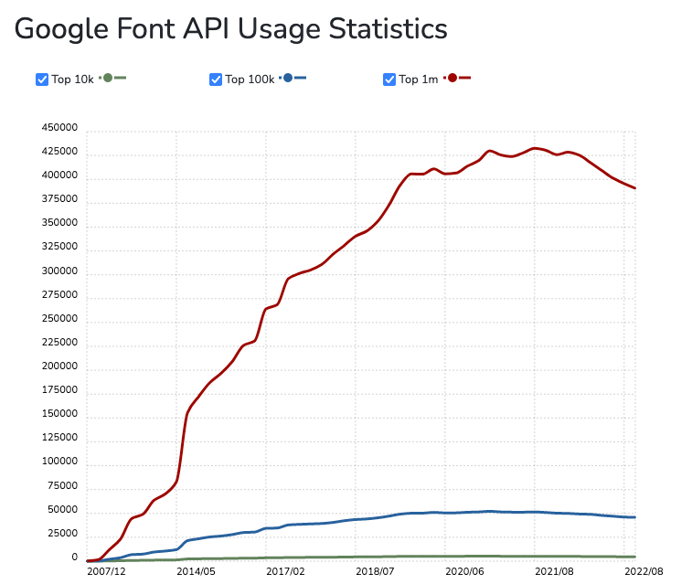

I remember when most websites used only web-safe fonts: Arial, Courier, Impact, Times New Roman, Verdana..., or the so-loved Comic Sans. Sad days for designers, great days for bandwidth. I also remember how the "new browsers" started supporting new features like `@font-face` to get a piece of the cake, at that time in the hands of Internet Explorer. A short while later, [Typekit was created](https://techcrunch.com/2009/11/11/typekit-launches-hopes-to-save-typography-on-the-web/) and it revolutionized the way typography was used on the web (Typekit was formerly acquired by Adobe and converted into Adobe fonts).

Google reacted quite fast by launching Google Fonts. We were still true believers of their *"Don't be evil"* motto and not aware enough of the truthfulness of the (now) [well-known](https://quoteinvestigator.com/2017/07/16/product/) assertion: *If you are not paying for it, you’re not the customer; you’re the product being sold*. So, we all started using that free product that offered us a wide variety of fast-loading fonts on all of our websites.

But the trend is changing. As you will see in the chart below, Google Fonts usage is decreasing since last year. Especially in the most popular sites in the world. If you continue reading, I'll explain to you my point of view about why it's happening.



## Privacy Matters

The Tech Giants have been taking advantage of our naivety for a while, and despite there being room for improvement, it seems that we are trying to fix it now. New privacy-related laws are emerging, for example, the General Data Protection Regulation (GDPR) in Europe that has led to [the first website being fined for using a Google-hosted font](https://www.theregister.com/2022/01/31/website_fine_google_fonts_gdpr/).

Its individual is free to share their data with whoever they want, you too, but we need to take into account that by adding a third-party script we are not providing them information from ourselves but from our users. I must confess it was irrelevant to me some time ago, but right now, **it seems unethical to me, and that's the biggest reason to argue in favor of discontinuing its use** that I can provide you. Bigger than the possibility of being fined.

## Performance Matters

Some people told me they were using Google Fonts because of its performance. I have serious doubts about it. I mean, I have doubts about whether they have actually measured the difference between self-hosting and Google Fonts. I have already made that assertion without any measure in the past, and *a thief believes everybody steals*.

The advantage of being able to avoid downloading fonts because the user had already downloaded it from another site using Google Fonts has been removed from most browsers due to the [partitioned browser cache](https://developer.chrome.com/blog/http-cache-partitioning/). It was one of the most repeated reasons to use third-party CDNs and now it's gone.

So, **the truth is that self-hosting with a good cache policy and prefetching properly could make your fonts load very fast**. Needless to say that nowadays self-hosting our fonts in a CDN is a thing: Netlify, Vercel, Cloudflare,... several options in the market will allow us to put our resources close to our users. I didn't run any benchmarks by myself, but you can find some pointing to the benefit of self-hosting [here](https://github.com/HTTPArchive/almanac.httparchive.org/pull/607) and [here](https://github.com/reactiflux/reactiflux.com/pull/21 ).

Therefore, my advice is not to use performance as an excuse to use Google Fonts. Especially if you do not measure it.

## Ease of Use Matters

The ease of use of Google Fonts is the biggest obstacle to convincing you to stop using it. I can not provide you with an implementation as simple as copy-pasting a single line into the head of your HTML document, but there are low-effort alternatives that can keep Big Brother away from your users.

## Alternatives

There are multiple alternatives to Google Fonts; **I'll provide you with the one I'm using currently in all my projects**, including this website: [Fontsource](https://fontsource.org). It's a project backed by Vercel that publishes and maintains NPM packages with Open Source fonts to be self-hosted.

They have a wide range of fonts, including some not in Google's catalog, and they provide [a search engine on their website](https://fontsource.org/docs/getting-started) to help you find the right one for your project.

Once you choose the fonts you like, you can install them as simply as installing any other NPM package:

```sh
npm install @fontsource/open-sans  
# or
yarn add @fontsource/open-sans 
# or
pnpm add @fontsource/open-sans 
```

Each font in Fontsource has its own package. The example above shows how to install Open Sans, but it would be the same with any of the rest fonts they offer. After installing the NPM package you need to include its CSS in your project, the way will depend on the tool or framework you are using, they have instructions for the most common ones on their website, but it would probably be as simple as:

```jsx
// Example to import the whole font:
import "@fontsource/open-sans";
// Example to import only some individual styles:
import "@fontsource/open-sans/500.css"; 
import "@fontsource/open-sans/900-italic.css"; 
```

After that, you'll be able to use `font-family: "Open Sans"` in your CSS files as usual. A bit more complicated than adding a single line but easy enough, isn't it?

I hope that this reading has generated in you, if not the conviction, at least the doubt that you should stop using Google Fonts. If you want to try other alternatives or fine-tune your website to load your fonts faster [this article](https://sia.codes/posts/making-google-fonts-faster/) from [Sia Karamalegos](https://sia.codes/) will make your day.
