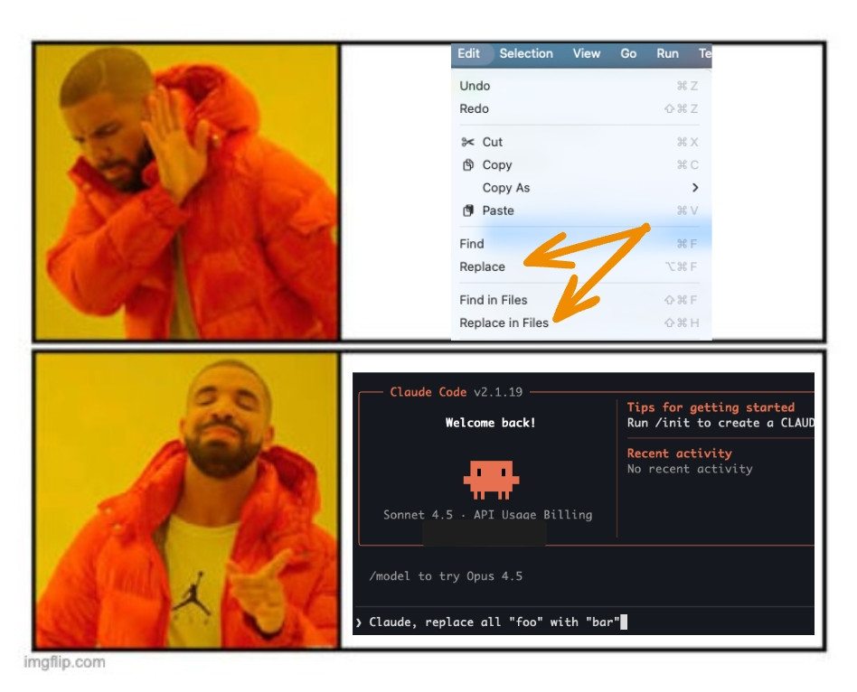

## Is This Vibe Coding?

Let's start with the name.

These days, every few months a new term appears to describe what is essentially the same thing: people using AI tools to write code.

First it was Vibe Coding (which even became "word of the year" [according to Collins](https://www.collinsdictionary.com/woty)). Then we got Agentic Coding, Augmented Coding, and I've even seen people start calling coding without an AI agent "Trad Coding". At this point, there are already [academic papers](https://arxiv.org/html/2505.19443v1) discussing the naming itself.

For me, all of this feels like unnecessary noise.

We're product developers. We use tools to help us do it. That's it.

So in this post, I'm just going to call it "programming with AI". Not because it's the perfect term, but because it doesn't try to turn a set of tools into a philosophy or a job position. 

## What Are We Actually Trying to Achieve?

When people talk about coding with AI, a lot of the conversation seems to revolve around one goal: writing less code by hand.

Sometimes it sounds like the ultimate achievement is to forget syntax entirely, stop worrying about best practices, and proudly say at your next conference talk or social media post that you shipped a feature without typing a single line by hand.

I get the excitement. New tools always trigger that kind of reaction. But measuring success by how many lines you manually typed is missing the point.

**The real objectives haven't changed just because we have better tools.**

From a company or product perspective, software is still just the medium. The goal is the same as it has always been: deliver value to users, solve real problems, and do it in a sustainable way. AI doesn't replace that objective; it simply becomes another tool we can use to reach it more efficiently.

From a developer's perspective, there's an additional layer.

Our personal goals should overlap with the company's, but we also have our own as individuals. We need to stay up to date with the state of the industry, keep our skills relevant, and be prepared to grow in our careers (or even change direction if needed or desired).

Tools like AI are clearly a major shift in how software is built, and ignoring them isn't being cautious, it's falling behind. Understanding how they work, where they help, where they fail, and how to use them responsibly is part of our craft.

I have to say, I'm happy to be working at [Paired](https://www.paired.com/) during this moment in time. Having access to these tools, and being actively encouraged to experiment with them in real work, makes a huge difference. 

## Whatever Will Be, Will Be

If you follow tech conversations right now, it often sounds like we're at the end of software development as a profession.

According to some voices, AI will change everything. We won't need developers anymore. We'll all become product managers, product designers, or "idea people" talking to bots that magically turn requirements into perfect software.

Maybe. But I wouldn't pay too much attention to confident predictions like these.

A year ago, many of the same gurus and media outlets were telling us that _Prompt Engineer_ would be the most in-demand job of the decade. Fast forward to today, and those same voices are now declaring that _prompt engineering_ is already dead.

I also notice that some of the loudest enthusiasm comes from people who have been in management roles for years, people who haven't written production code in five or ten years, and who can suddenly "code again" thanks to AI.

And that's great.

There's real value in being able to tackle technical debt yourself, fix that long-standing performance issue, or experiment with ideas without pulling a developer away from feature work. I don't want to downplay that at all.

But in many cases, these perspectives come from occasional contributions that bypass the usual product team workflows and long-term maintenance realities. It's a very different experience from being a contributor working daily in a large codebase with real constraints.

The excitement is understandable, especially for people with a strong technical background who can suddenly "play" again, but excitement doesn't equal accurate forecasting. We should listen to these experiences, but we shouldn't treat anyone as a prophet of the future.

There's also a bigger question around sustainability.

Right now the hype is massive, investments are huge, and we're being encouraged to use AI everywhere (sometimes for things as trivial as generating memes or writing commit messages nobody will ever read). It's hard to believe this level of resource consumption can grow forever without hitting limits, whether technical, economic, or environmental.

How this technology evolves over the next years is still very much an open question, and I think trying to predict the long-term future of our industry is mostly a waste of energy. If we already agree that estimating software tasks a year in advance is unreliable, trying to predict what software development will look like in ten years is even more unrealistic.

What I am sure about is this: **ignoring AI entirely is not an option**. If we want to stay valuable as professionals, we need to understand these tools and how they fit into modern development.

A good parallel is frontend development. You might love or hate the JavaScript framework ecosystem. You might think things were simpler when it was just HTML, CSS, and a bit of jQuery. But today, if you don't understand modern frontend tools and workflows, it's very hard to find good opportunities.

Whether you like them or not is almost irrelevant. AI feels similar.

## How I'm Using AI Right Now

My main tools are [Cursor](https://cursor.com/) and [Claude Code](https://claude.com/product/claude-code). But, before getting into specifics, one important caveat: the way I use AI today will almost certainly be different in a month.

The tools are evolving incredibly fast, new workflows appear every week, and what feels cutting-edge now may look naive very soon. So think of this section as a snapshot of my current approach, not a definitive recipe.

### Not Everything Needs an Agent

I recently saw this meme [shared by Aleix Morgadas on Bluesky](https://bsky.app/profile/aleixmorgadas.dev/post/3mdfoyo4aqs2e). It's funny because it's true. And it's also a good example of where AI is simply not the right tool.

Modern IDEs are already extremely good at certain things: search and replace, safe refactors, renaming symbols, moving files, extracting methods, and so on. These operations are fast, predictable, and resource-efficient.

Using AI for that kind of work is often slower and, honestly, a waste. Not every solution becomes better just because you throw a large language model at it.

### When Manual Is Still Faster or Better

We work on a large codebase, and I have deep knowledge of it. In many situations, I already know:

- where the bug lives
- which files are involved
- what needs to change

In those cases, doing it manually is still faster and more precise than explaining everything to an agent.

AI shines when context is large, unclear, or spread across many files. When the context already lives in your head, manual work often wins, and that's perfectly fine.

### Learning by doing

I recently built a [small pet project](https://skywrapped.app/) to learn about the AT Protocol and Svelte. It was a perfect playground: no risk, no expectations, starting from scratch.

In that scenario, fully delegating things to agents can make a lot of sense.

But in this particular case, my objective was to learn. So, in my opinion, avoiding writing code would have actively worked against my goal.

Did I avoid AI entirely? Not at all.

Cursor's autocomplete ("the tab thingy") is almost magical, and I used it constantly. Once I felt comfortable with the basics, I also delegated some tasks to the agent.

But I still made sure to write, read, and understand the core pieces myself.

Some people may argue that learning frameworks or protocols no longer makes sense in the age of AI. I strongly disagree.

I'm happy to use a calculator for maths. I'm also happy to understand how maths works.

I really liked [this post by Mikayla Maki](https://zed.dev/blog/on-programming-with-agents) from the Zed IDE team about programming with agents. One idea in particular resonated a lot with me:

Only use agents for tasks you already know how to do.

I think that's an excellent default rule. Break it as much as you want, for example, you can also use agents for things you don't know but don't really care to master. But for core concepts you want to understand deeply, staying hands-on still matters.

### My Workflow for Bigger Changes: Get Context, Plan, Execute

For anything larger than a small refactor or a quick bug fix, I try to be much more structured. I follow a very explicit flow, and as far as I know, it's the same approach many developers follow nowadays:

Get Context → Plan → Execute

Let's break it down.

#### 1. Get Context

I use `AGENTS.md` files across the relevant parts of my repos. These files describe what we consider important for that area of the codebase: architectural decisions, conventions, instructions on how to run quality checks, and the kind of patterns we expect the agent to follow.

If I'm doing this for an existing codebase, I usually bootstrap these files with AI, but the output of `claude init` is usually too much, so I curate it manually trying to keep it intentionally small at the beginning. Then, as I work with agents and notice friction, (misunderstandings, repeated mistakes, or missing assumptions) I improve these files over time. It's a feedback loop: every annoyance is an opportunity to make future interactions smoother.

But, one important thing I've learned is not to put everything into `AGENTS.md`.

If you try to dump all documentation, rules, and context into a single file, you quickly end up with massive prompts and unnecessary "context overflow". The agent gets overwhelmed with information it doesn't always need and you'll waste a relevant number of tokens.

Instead, I split deeper documentation into multiple markdown files inside a dedicated documentation folder. The `AGENTS.md` files then simply explain where to find things and when to use them.

This pattern is starting to be known as progressive disclosure: give the agent just enough to start, and point it to more detailed information only when relevant. There's a [great post on HumanLayer](https://www.humanlayer.dev/blog/writing-a-good-claude-md) about this approach, along with other very practical tips. I recommend taking a look also at [this other post from Diego Munoz](https://blog.kartones.net/post/making-ai-agents-more-effective-without-fine-tuning-or-rag/) to know how to organise your `AGENTS.md` files and make them compatible with Claude Code.

What you read above is something that will work for every task, but when prompting the agent to work on something, you should also explicitly point it to:

- Relevant files
- Similar implementations
- Good examples in the codebase

The better the context, the better everything that follows.

#### 2. Planning

Before allowing the agent to modify anything, I prompt it to propose a plan.

I don't want vague steps like "implement feature X". I ask the agent to write a plan with small, vertical slices that could realistically be reviewed and deployed independently. I usually ask for baby steps, ideally following a TDD-like workflow, just as a human developer would.

Another key part of the plan is defining explicit contracts. Depending on the project, that might mean clearly stating which endpoints will change, what database migrations are needed, which use cases are impacted, or which components will be added or refactored. We can be even more explicit and ask the agent to write down the full list of files that it will add, edit or remove.

The goal is for the plan to be as concrete and predictable as possible.

In addition, I ask the agent to explicitly define the phases and create a plan progress tracker in the same file. It becomes a living document that tracks progress, allows you to pause and resume work cleanly, and serves as a review artifact.

Finally, the plan is written into the repository and presented for review. I ask for modifications if I don't like something and the agent will not execute anything until there's agreement.

#### 3. Executing Phase by Phase

Once the plan is approved, I ask the agent to execute it step by step.

There are different ways to handle this in practice. Some people prefer the agent to create the PRs and they review them on Github or similar, others prefer to review the code before the commits, and sometimes, the plan is so clear that you can just let the agent fly free.

What matters is that progress is continuously written back into the plan file, that any new insights get fed into the `AGENTS.md` or documentation files, and that the human stays in control. Every time you learn something new about how the agent behaves, you make the system better for next time.

#### The Tool Is Secondary

I personally use this flow mostly with Claude Code because it's worked extremely well for me, but there's nothing Claude-specific about it.

You can apply the same structure with Cursor, GitHub Copilot, or whatever tool comes next. The discipline of context, planning, and controlled execution matters far more than the specific AI you're using.

To make this process easier (and reusable across the team), we actually wrapped most of this into two commands, which are essentially two carefully crafted prompts: `/create-plan` and `/execute-plan`.

## Liking the Game VS Playing the Game

For years, anyone using P2P networks to share copyrighted content was called a thief or a pirate. Now we're supposed to applaud massive corporations for training large language models on enormous amounts of scraped content. Most of it taken without consent.

In many cases, that content comes from the very people these systems are now trying to replace or push out of their industries.

Yes, as an open source developer, I've shared my code under licenses that allow this kind of use. That was a conscious choice. But that's not the situation for many others: visual artists, translators, writers, or even platforms like Stack Overflow, whose content was created under very different expectations and terms.

The contrast becomes even harder to ignore when you think about Aaron Swartz. He was relentlessly prosecuted for making academic research freely accessible, without profit, and with the goal of expanding public knowledge. Our society destroyed him for doing a tiny fraction of what today's corporations have done at massive scale and for enormous commercial gain.

This critical attitude towards generative AI is what has earned me the “hater” label more than once. And yes, I am probably a hater.

But I've also been a Microsoft hater and still worked at a Microsoft partner, and ended up speaking at `.NET` conferences.

I've been an Apple hater too, yet here I am, making the most of M-series chips and enjoying drawing with Procreate on an iPad Pro.

Unfortunately, programming with AI is part of the game now. So, until we abolish wage labor and capitalism, I'll try to master it the same way I did with other things and keep playing this game in the big leagues; whether I like it or not.
