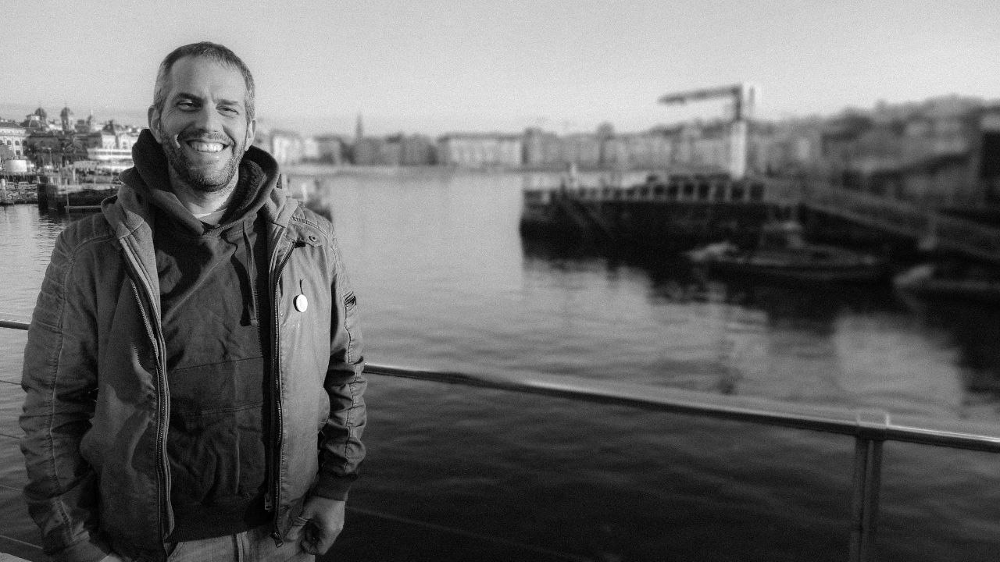

I'm **Alberto Varela**, a 41 years old **full-stack developer** based in Bilbao with more than 20 years of experience. I'm passionate about everything related to web development, and I'm currently working as a Product Engineer at [Paired](https://www.paired.com/). The easiest way to get in touch is via email: [hello@albertovarela.net](mailto:hello@albertovarela.net).

**I like to** work in agile teams where I can **participate and help at every stage of product development**. I've worked with several technologies and frameworks (both backend and frontend), and I've implemented continuous integration and continuous deployment pipelines in several projects. I also have experience heading the development department in a small start-up, but currently prefer the individual contributor path.

I like to attend meetups and conferences, especially local ones. I have been also giving some workshops and talks at events like [Software Crafters Barcelona](https://softwarecrafters.barcelona/), [Commit Conf](https://commit-conf.com), or [DotNet](https://dotnet2019.com/), and I usually try to participate in open spaces.

I think my two best qualities are that I like to teach what I know, and that I know I still have a lot to learn.

*You can see my formal CV [in LinkedIn](https://www.linkedin.com/in/artberri).*
